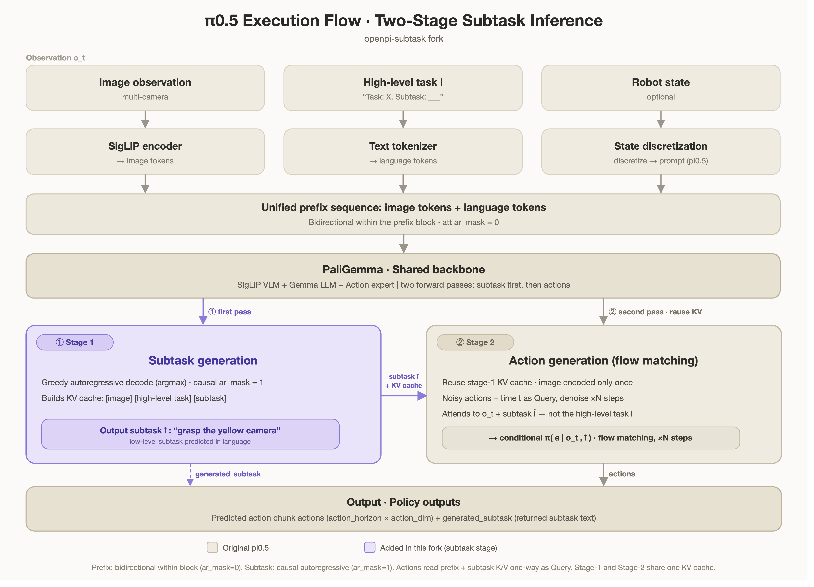

# openpi-subtask-reproduction

[中文说明](README_CN.md) | English

Full OpenPI/JAX reproduction fork with pi0.5-style two-stage subtask inference.

This repository is a fork of OpenPI. The upstream OpenPI README is preserved as
[README_OPENPI.md](README_OPENPI.md).

The goal of this fork is to reproduce the OpenPI training/inference stack and add
the pi0.5 hierarchical subtask path:

```text
high-level task + observation -> generated subtask -> action chunk
```

It is a code and pipeline reproduction. It does not reproduce Physical
Intelligence's private pi0.5 data mixture, full-scale training recipe, or reported
real-world performance.

## Architecture



The diagram above follows the core factorization from the pi0.5 paper,
`pi0.5: A Vision-Language-Action Model with Open-World Generalization`:

- The model first predicts a semantic subtask from the current observation and
  high-level task: `pi(l_hat | o_t, l)`.
- The action expert then predicts low-level action chunks conditioned on the
  observation and generated subtask: `pi(a | o_t, l_hat)`.
- Robot proprioceptive state is discretized into language tokens for pi0.5-style
  prompting.
- Continuous action chunks are generated with the pi0 / pi0.5 flow-matching
  action expert.
- Prefix tokens are bidirectional, while generated subtask tokens are decoded
  autoregressively.

The KV-cache reuse shown in the figure is this fork's implementation detail: stage
1 builds a cache over `[images][high-level task][subtask]`, and stage 2 reuses it
so images are encoded once. The action expert is masked so it attends to
`o_t + l_hat` and not to the high-level task `l`, matching the paper's low-level
factorization.

## What This Fork Adds

### pi0.5 subtask model type

This fork adds:

- `ModelType.PI05_SUBTASK`
- `Pi05SubtaskConfig`
- `Pi05Subtask`

Key files:

- [src/openpi/models/model.py](src/openpi/models/model.py)
- [src/openpi/models/pi0_config.py](src/openpi/models/pi0_config.py)
- [src/openpi/models/pi0.py](src/openpi/models/pi0.py)

Training combines:

```text
subtask cross-entropy loss + action flow-matching loss
```

### State-conditioned subtask tokenization

For pi0.5 subtask training/inference, prompts can include discretized robot state:

```text
Task: <high-level task>, State: <discretized_state>;
Subtask: <low-level subtask>
```

During inference, the model receives only the prefix:

```text
Task: <high-level task>, State: <discretized_state>;
Subtask:
```

and autoregressively generates the subtask text.

Key files:

- [src/openpi/models/tokenizer.py](src/openpi/models/tokenizer.py)
- [src/openpi/transforms.py](src/openpi/transforms.py)

### Paper-faithful low-level conditioning

The latest implementation emits `token_highlevel_mask` for subtask paths. During
stage-2 action generation, the action expert attends to image/state tokens and
generated subtask tokens, while high-level task columns are removed from the
action attention mask:

```text
low-level policy: pi(a | o_t, l_hat)
```

This is the important distinction from a plain "Task + Subtask -> actions" prompt:
the high-level task is used to infer the subtask, but the low-level action expert
executes the generated subtask.

### Two-stage inference

Inference can run as:

```text
1. generate subtask from image/state/task prefix
2. reuse the stage-1 KV cache
3. sample the action chunk with flow matching
4. return both actions and generated_subtask
```

Key methods:

- `generate_subtask(...)`
- `_generate_subtask_with_cache(...)`
- `sample_actions_hierarchical(...)`

Key output:

```text
generated_subtask
```

### LeRobot v3 subtask data support

This fork supports frame-level subtask supervision in LeRobot-style datasets.
Subtask labels can be present directly as a `subtask` column, or indirectly via:

```text
subtask_index -> meta/subtasks.parquet
```

Recommended structure:

```text
dataset/
  data/
    chunk-000/
      file-000.parquet          # frame rows with state, action, task/subtask indices
  meta/
    info.json
    stats.json
    tasks.parquet               # task_index -> task text
    subtasks.parquet            # subtask_index -> subtask text
    subtask_segments.csv        # optional annotation/debug summary
  videos/
    ...
```

Example subtask labels:

```text
Task: pull the red phone out from the right side of the tray and insert it into the left side

Subtasks:
  move the gripper to the red phone
  grasp the red phone
  pull the red phone out from the right side of the tray
  move the red phone toward the left side of the tray
  insert the red phone into the left side of the tray and release
```

## Important Configs and Scripts

Configs:

- `pi05_subtask_libero`
- `pi05_subtask_libero_infer`
- `pi05_subtask_pickup_round1_50ep_lora`
- `debug_pi05_subtask`

Scripts:

- [scripts/validate_subtask_on_dataset.py](scripts/validate_subtask_on_dataset.py)
- [scripts/visualize_subtask_predictions.py](scripts/visualize_subtask_predictions.py)
- [scripts/visualize_subtask_episode_timeline.py](scripts/visualize_subtask_episode_timeline.py)
- [scripts/visualize_subtask_prediction_video.py](scripts/visualize_subtask_prediction_video.py)
- [scripts/plot_action_predictions_on_dataset.py](scripts/plot_action_predictions_on_dataset.py)

`validate_subtask_on_dataset.py` reports whether generation hit `max_tokens`, which
helps distinguish true model early-stop errors from text truncation.

## Environment

For Linux/CUDA machines, use the provided Conda environment:

```bash
conda env create -f environment-openpi-jax.yml
conda activate openpi-jax
```

Or install with uv:

```bash
GIT_LFS_SKIP_SMUDGE=1 uv sync
GIT_LFS_SKIP_SMUDGE=1 uv pip install -e .
```

The pinned JAX dependency uses CUDA 12 wheels. On macOS, full `uv run pytest` may
fail during dependency resolution because `jax-cuda12-plugin` does not publish a
macOS arm64 wheel.

## Typical Workflow

1. Start from an OpenPI/LeRobot dataset.
2. Add frame-level `subtask` or `subtask_index` annotations.
3. Compute normalization stats.
4. Fine-tune a pi0.5 subtask config.
5. Validate generated subtasks.
6. Render prediction videos and action plots.

Example commands:

```bash
uv run scripts/compute_norm_stats.py --config-name pi05_subtask_pickup_round1_50ep_lora

uv run scripts/train.py pi05_subtask_pickup_round1_50ep_lora \
  --exp-name=subtask_smoke \
  --overwrite

uv run scripts/validate_subtask_on_dataset.py \
  --config-name pi05_subtask_pickup_round1_50ep_lora \
  --checkpoint-dir checkpoints/pi05_subtask_pickup_round1_50ep_lora/subtask_smoke

uv run scripts/visualize_subtask_prediction_video.py \
  --config-name pi05_subtask_pickup_round1_50ep_lora \
  --checkpoint-dir checkpoints/pi05_subtask_pickup_round1_50ep_lora/subtask_smoke \
  --output outputs/subtask_success_segment.mp4
```

## Relationship to Upstream OpenPI

This repository keeps the upstream OpenPI model/training stack as the base.
Most existing OpenPI configs, policies, and examples remain present. The fork
mainly changes the pi0.5 subtask path, tokenizer/transforms, LeRobot subtask
loading, two-stage inference, validation, and visualization tooling.

For base OpenPI installation, checkpoints, model notes, and examples, see
[README_OPENPI.md](README_OPENPI.md).
