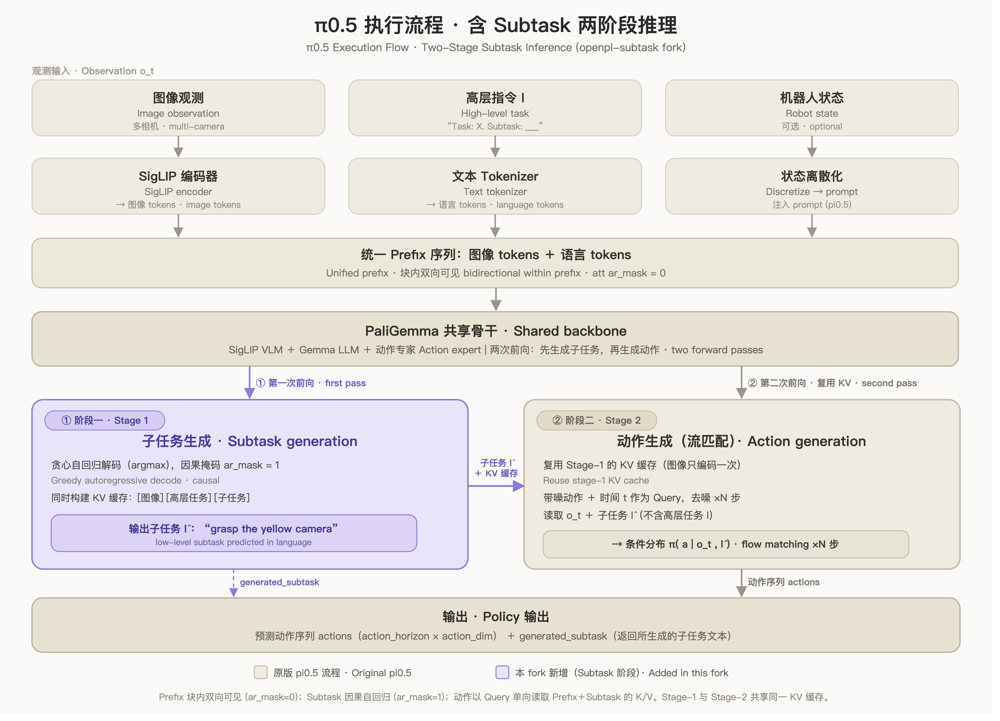

# openpi-subtask-reproduction

中文说明 | [English](README.md)

本仓库是一个 OpenPI/JAX 复现 fork，并在原版 OpenPI 基础上加入 pi0.5 风格的
Subtask 两阶段推理。

原版 OpenPI README 保留在 [README_OPENPI.md](README_OPENPI.md)。

本仓库目标是复现 OpenPI 的训练、数据、推理工程栈，并加入：

```text
高层任务 + 当前观测 -> 预测子任务 -> 预测动作序列
```

这里说的“复现”指代码路径和实验管线复现，不代表复现 Physical Intelligence
内部的 pi0.5 私有数据、多源大规模训练配方或论文中的真实机器人性能。

## 架构图



这张图和论文 `pi0.5: A Vision-Language-Action Model with Open-World Generalization`
里的核心建模方式一致：

- 高层阶段预测子任务：`pi(l_hat | o_t, l)`。
- 低层阶段预测动作：`pi(a | o_t, l_hat)`。
- `o_t` 包含多相机图像和机器人本体状态。
- 机器人状态会离散化后作为文本 token 输入模型。
- 动作由 action expert 用 flow matching 生成。
- prefix 内部是双向可见，subtask 文本是自回归生成。

图里的 KV cache 复用是本 fork 的工程实现：第一阶段生成子任务时构建
`[图像][高层任务][子任务]` 的缓存，第二阶段动作生成直接复用这个缓存，因此图像只编码一次。
同时，动作专家通过 `token_highlevel_mask` 屏蔽高层任务 token，只读取 `o_t + l_hat`，
这对应论文中的低层分解 `pi(a | o_t, l_hat)`。

## 相比原版 OpenPI 改了什么

### 1. 新增 pi0.5 subtask 模型类型

新增：

- `ModelType.PI05_SUBTASK`
- `Pi05SubtaskConfig`
- `Pi05Subtask`

核心文件：

- [src/openpi/models/model.py](src/openpi/models/model.py)
- [src/openpi/models/pi0_config.py](src/openpi/models/pi0_config.py)
- [src/openpi/models/pi0.py](src/openpi/models/pi0.py)

训练目标变为：

```text
subtask 交叉熵损失 + action flow-matching 损失
```

### 2. Subtask tokenization 支持 state

训练时可以使用：

```text
Task: <高层任务>, State: <离散化状态>;
Subtask: <低层子任务>
```

推理时只给：

```text
Task: <高层任务>, State: <离散化状态>;
Subtask:
```

模型会自回归补全子任务。

核心文件：

- [src/openpi/models/tokenizer.py](src/openpi/models/tokenizer.py)
- [src/openpi/transforms.py](src/openpi/transforms.py)

### 3. 低层动作更贴近论文

最新实现里，subtask 路径会产生 `token_highlevel_mask`。动作生成阶段会屏蔽高层任务 token，
让 action expert 只条件在：

```text
当前观测 o_t + 预测子任务 l_hat
```

也就是：

```text
pi(a | o_t, l_hat)
```

这比简单地把 `Task + Subtask` 全塞给动作模型更接近论文。

### 4. 两阶段推理

推理流程：

```text
1. 根据 image/state/task prefix 生成 subtask
2. 保留并复用 stage-1 KV cache
3. 用 flow matching 生成 action chunk
4. policy 输出 actions 和 generated_subtask
```

关键输出：

```text
generated_subtask
```

### 5. LeRobot v3 subtask 数据格式

推荐数据集仍然是 LeRobot 风格。普通 OpenPI 需要：

```text
image/video observations
state
actions
task_index -> meta/tasks.parquet
```

真实 subtask 训练还需要：

```text
subtask 或 subtask_index -> meta/subtasks.parquet
```

推荐结构：

```text
dataset/
  data/
    chunk-000/
      file-000.parquet
  meta/
    info.json
    stats.json
    tasks.parquet
    subtasks.parquet
    subtask_segments.csv
  videos/
    ...
```

示例：

```text
Task: 把红色手机从托盘右侧拿出，并放入托盘左侧

Subtasks:
  move the gripper to the red phone
  grasp the red phone
  pull the red phone out from the right side of the tray
  move the red phone toward the left side of the tray
  insert the red phone into the left side of the tray and release
```

## 重要配置和脚本

配置：

- `pi05_subtask_libero`
- `pi05_subtask_libero_infer`
- `pi05_subtask_pickup_round1_50ep_lora`
- `debug_pi05_subtask`

脚本：

- [scripts/validate_subtask_on_dataset.py](scripts/validate_subtask_on_dataset.py)
- [scripts/visualize_subtask_predictions.py](scripts/visualize_subtask_predictions.py)
- [scripts/visualize_subtask_episode_timeline.py](scripts/visualize_subtask_episode_timeline.py)
- [scripts/visualize_subtask_prediction_video.py](scripts/visualize_subtask_prediction_video.py)
- [scripts/plot_action_predictions_on_dataset.py](scripts/plot_action_predictions_on_dataset.py)

`validate_subtask_on_dataset.py` 会输出是否命中 `max_tokens`，可以区分生成文本被截断，
还是模型自己提前生成 EOS。

## 环境

Linux/CUDA 机器推荐使用 Conda 环境：

```bash
conda env create -f environment-openpi-jax.yml
conda activate openpi-jax
```

也可以用 uv：

```bash
GIT_LFS_SKIP_SMUDGE=1 uv sync
GIT_LFS_SKIP_SMUDGE=1 uv pip install -e .
```

当前 JAX 依赖使用 CUDA 12 wheel。在 macOS 上，完整 `uv run pytest` 可能会因为
`jax-cuda12-plugin` 没有 macOS arm64 wheel 而无法解析依赖。

## 建议实验流程

1. 准备一个小 LeRobot 数据集。
2. 用标注工具补 frame-level `subtask` 或 `subtask_index`。
3. 计算 normalization stats。
4. 先跑 20-50 episodes 的 LoRA smoke test。
5. 用 `validate_subtask_on_dataset.py` 看 subtask 是否生成完整。
6. 用视频脚本看每个阶段的 GT 和 Pred。
7. 再看 `plot_action_predictions_on_dataset.py` 的动作拟合情况。

常用命令：

```bash
uv run scripts/compute_norm_stats.py --config-name pi05_subtask_pickup_round1_50ep_lora

uv run scripts/train.py pi05_subtask_pickup_round1_50ep_lora \
  --exp-name=subtask_smoke \
  --overwrite

uv run scripts/validate_subtask_on_dataset.py \
  --config-name pi05_subtask_pickup_round1_50ep_lora \
  --checkpoint-dir checkpoints/pi05_subtask_pickup_round1_50ep_lora/subtask_smoke

uv run scripts/visualize_subtask_prediction_video.py \
  --config-name pi05_subtask_pickup_round1_50ep_lora \
  --checkpoint-dir checkpoints/pi05_subtask_pickup_round1_50ep_lora/subtask_smoke \
  --output outputs/subtask_success_segment.mp4
```

## 和原版 OpenPI 的关系

本仓库保留原版 OpenPI 的模型、训练、策略、serving 和示例工程栈。fork 的主要改动集中在：

- pi0.5 subtask 模型路径
- tokenizer 和 data transforms
- LeRobot subtask 标签读取
- 两阶段 subtask/action 推理
- subtask 验证和可视化脚本
- action prediction 可视化脚本

原版 OpenPI 的安装、checkpoint、基础模型说明和通用示例请看
[README_OPENPI.md](README_OPENPI.md)。
